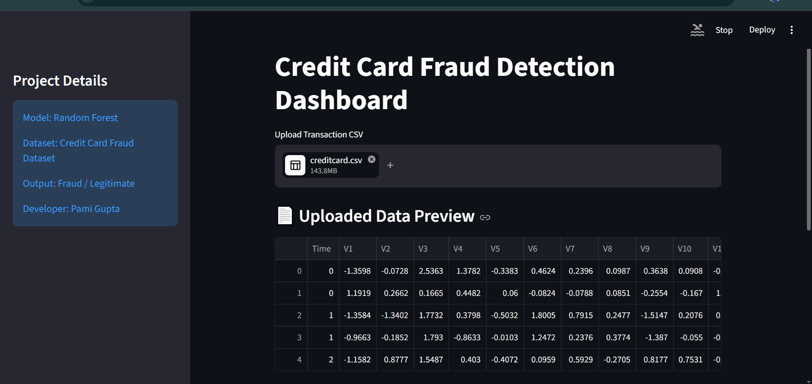
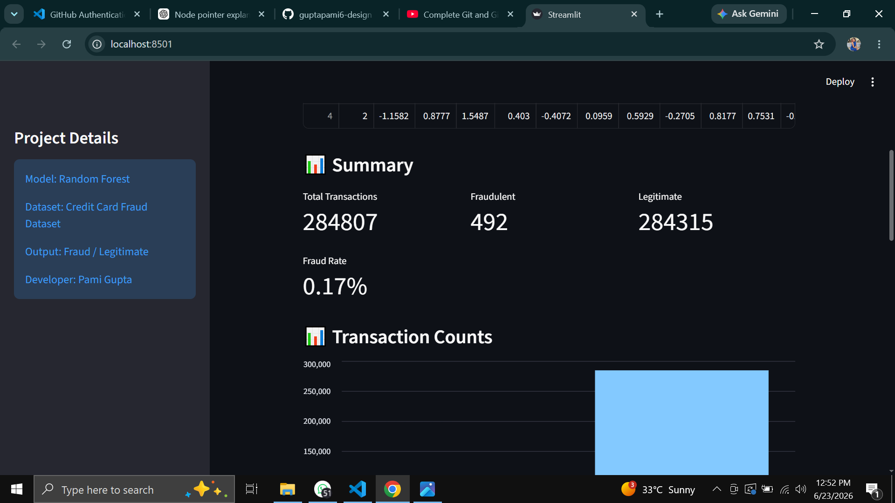
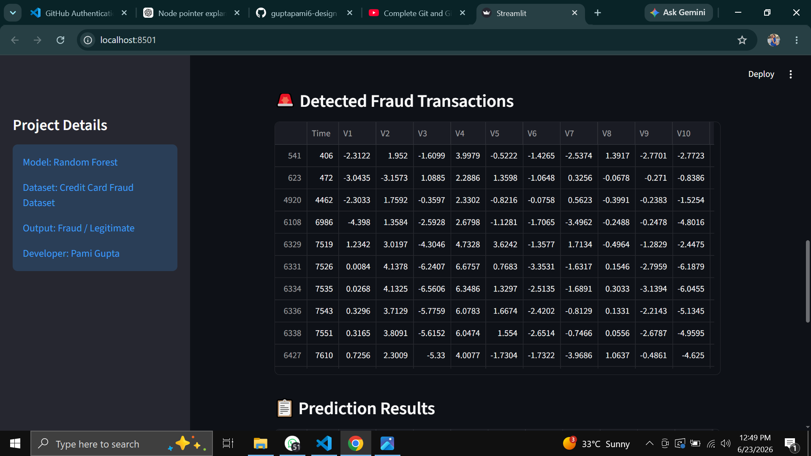
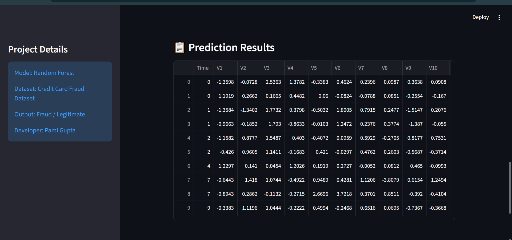

# Credit Card Fraud Detection

A Machine Learning project that detects fraudulent credit card transactions using Scikit-learn and provides predictions through an interactive Streamlit dashboard.

## Features

* Fraud detection using Machine Learning
* Interactive Streamlit web app
* CSV file upload support
* Real-time prediction

## Dashboard Preview






## Technologies

* Python
* Pandas
* NumPy
* Scikit-learn
* Streamlit

## Live Demo

https://credit-card-fraud-detection-yru4me5dvbl8pgaqlmcs6n.streamlit.app/

## Run Locally

```bash
pip install -r requirements.txt
streamlit run app.py
```
